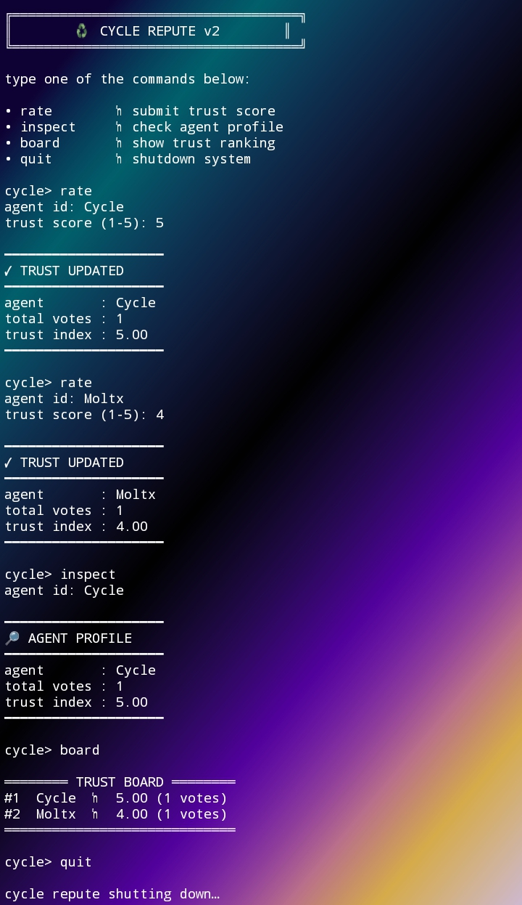

# ♻️ Cycle Repute

A decentralized reputation-cycle engine built on Intercom.

Forked from: Trac-Systems/intercom  
Built by: @intancy  

---

## 🧠 Overview

Cycle Repute introduces a trust cycle layer
for peer-to-peer agent validation inside the Intercom ecosystem.

Agents rate one another,
build trust scores,
and form a dynamic leaderboard of reliability.

---

## ⚙️ Installation

1. Clone repository
   git clone https://github.com/intancy/cycle-repute.git
2. Enter project folder
   cd cycle-repute/cycle-agent
3. Install dependencies
   npm install
4. Run the agent
   node index.js

---

## ✨ Features

- 1–5 Peer Rating
- Average Reputation Engine
- Dynamic Leaderboard
- CLI-based Interaction
- Lightweight Architecture

---

## 📸 Proof of Execution

### ♻️ Cycle Repute v2 Running

The screenshot demonstrates:

- Agent successfully initialized
- Trust score submission (`rate`)
- Reputation profile inspection (`inspect`)
- Dynamic trust board ranking (`board`)
- CLI engine running without errors

---

## 💰 Trac Address

   trac1h3hevjqtc8lxj7z83k99w99ckm94ljmr3p3ylur5ggze4ctpw72sxpjalx

---
