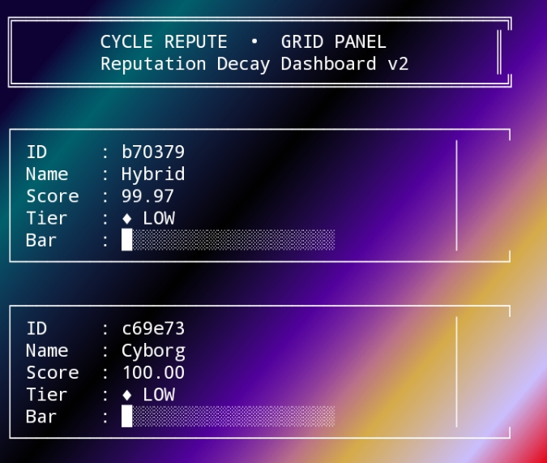

# CYCLE REPUTE
### Reputation Decay Engine – Grid Panel Edition

A dynamic reputation management engine featuring time-based decay,
tier classification, and a structured grid dashboard interface.

This fork introduces a redesigned grid-based CLI panel,
progress-based scoring system, and history tracking mechanism.

━━━━━━━━━━━━━━━━━━━━━━━━━━━━━━━━━━━━━━━━━━

## 🧠 Core Concept

Cycle Repute simulates a decentralized reputation engine where:

- Reputation increases or decreases via actions
- Score decays automatically over time
- Users are classified into trust tiers
- Historical actions are logged
- Grid-based UI displays structured panel data

━━━━━━━━━━━━━━━━━━━━━━━━━━━━━━━━━━━━━━━━━━

## ✨ Features

- ⏳ Time-based reputation decay (2% hourly model)
- 🏆 Tier classification (LOW → STANDARD → TRUSTED → ELITE)
- 📊 Visual progress bar
- 🗂 Action history tracking
- 🔐 Crypto-based random user ID
- 🧱 Grid Panel CLI layout
- 🔄 Real-time score recalculation

━━━━━━━━━━━━━━━━━━━━━━━━━━━━━━━━━━━━━━━━━━

## 🖥 Grid Panel Preview

TRAC Address:
trac1h3hevjqtc8lxj7z83k99w99ckm94ljmr3p3ylur5ggze4ctpw72sxpjalx

━━━━━━━━━━━━━━━━━━━━━━━━━━━━━━━━━━━━━━━━━━

## 🛠 Installation

git clone https://github.com/intancy/cycle-repute.git  
cd cycle-repute  
node index.js  

━━━━━━━━━━━━━━━━━━━━━━━━━━━━━━━━━━━━━━━━━━

## ⚙️ Available Commands

register  → Create new user  
gain      → Increase reputation  
lose      → Decrease reputation  
history   → Show action history  
list      → Refresh dashboard  
exit      → Shutdown engine  

━━━━━━━━━━━━━━━━━━━━━━━━━━━━━━━━━━━━━━━━━━

## 🧮 Reputation Logic

Decay Formula:

newScore = currentScore - (currentScore × 0.02 × hoursElapsed)

Tier Thresholds:

0–199    → LOW  
200–499  → STANDARD  
500–999  → TRUSTED  
1000+    → ELITE  

━━━━━━━━━━━━━━━━━━━━━━━━━━━━━━━━━━━━━━━━━━

## 🏗 Architecture

- Node.js CLI Engine
- In-memory state management
- Dynamic rendering layer
- Time-differential scoring model
- Modular command routing
- Grid-based UI renderer

━━━━━━━━━━━━━━━━━━━━━━━━━━━━━━━━━━━━━━━━━━

## 🚀 Why This Fork Is Different

This version introduces:

- Full grid-based dashboard layout
- Tier badge visualization
- Score progress bar rendering
- Time-based decay recalculation engine
- Structured panel formatting
- Extended command routing system
- History persistence during runtime

This is not a cosmetic fork — it upgrades logic,
rendering structure, and system behavior.

━━━━━━━━━━━━━━━━━━━━━━━━━━━━━━━━━━━━━━━━━━

## 📜 License

MIT License – Grid Panel Reputation Engine Edition
